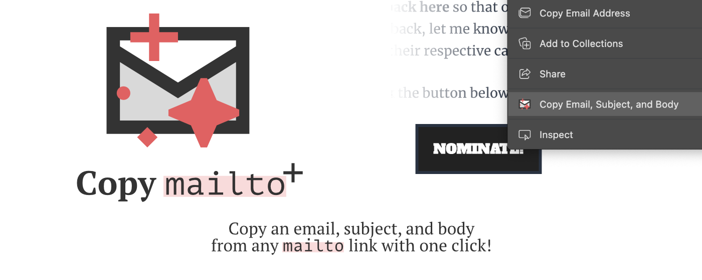

    

# Copy `mailto`+

A free browser extension that makes copying email links painless ✨

## Install options

⚡️ [Install from the Chome Web Store](https://chromewebstore.google.com/detail/copy-mailto+/aogkcfehpjcccedmilfebhdmiceblped)

⚡️ [Install from the Edge Add-ons store](https://microsoftedge.microsoft.com/addons/detail/copy-mailto/fiaadeobfpieggpebihdfkgencjhfoon)

## How to use without any of that webstore nonsense

- Download/clone this repository
- On Edge, go to `edge://extensions`, or on Chrome, go to `chrome://extensions`
- Toggle on "Developer Mode"
- Click the "Load Unpacked" button
- Select the unzipped extension folder
- Look for the lil sparkly envelope icon (as seen in the image above), and make sure it's toggled on
- And you're installed! To test it, you can try a website ([like this one, the "Nominate" button](https://indienewsletters.com/nominate/)) that has a `mailto` link in it, right click the link, and select "Copy Email, Subject, and Body".
- Voilà!
